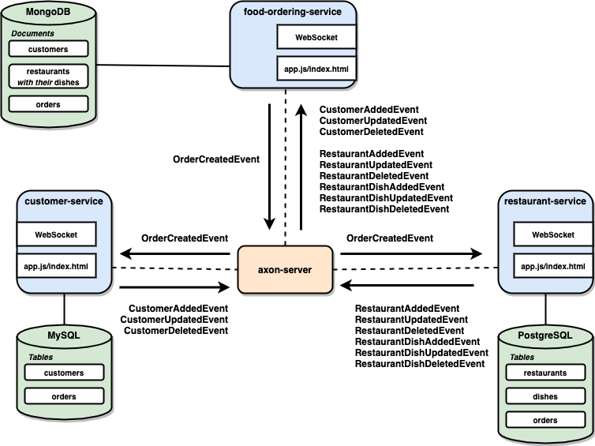
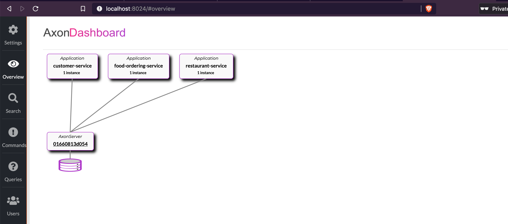

# axon-springboot

The goal of this project is play with [`Axon`](https://axoniq.io/). For it, we will implement a `food-ordering` app that consists of three [`Spring Boot`](https://docs.spring.io/spring-boot/docs/current/reference/htmlsingle/) applications: `customer-service`, `restaurant-service` and `food-ordering-service`. Those services were implemented with [`CQRS`](https://martinfowler.com/bliki/CQRS.html) and [`Event Sourcing`](https://martinfowler.com/eaaDev/EventSourcing.html) in mind so, in order to achieve it, we used [`Axon Framework`](https://axoniq.io/product-overview/axon-framework). Those three services are connected to `axon-server` that is the [`Event Store`](https://en.wikipedia.org/wiki/Event_store) and `Message Routing` solution used.

## Project Architecture



## Applications

- ### customer-service

  `Spring Boot` application that exposes a REST API to manage `Customers`. This service was implemented using `Axon Framework`. Everytime a customer is added, updated or deleted, the service emits the respective event, i.e, `CustomerAddedEvent`, `CustomerUpdatedEvent` or `CustomerDeletedEvent`.
  
  `customer-service` uses `MySQL` to store customers data. Besides, it listens to order events, collects the order information that it needs and stores them in an order table present in its own database, so that it doesn't need to call another service to get this information.

- ### restaurant-service

  `Spring Boot` application that exposes a REST API to manage `Restaurants`. This service was implemented using `Axon Framework`. Everytime a restaurant is added, updated or deleted, the service emits the respective event, i.e, `RestaurantAddedEvent`, `RestaurantUpdatedEvent` or `RestaurantDeletedEvent`. The same applies to the restaurant dishes, whose events are: `RestaurantDishAddedEvent`, `RestaurantDishUpdatedEvent` or `RestaurantDishDeletedEvent` 
  
  `restaurant-service` uses `PostgreSQL` to store restaurant/dish data. Besides, it listens to order events, collects the order information that it needs and stores them in an order table present in its own database, so that it doesn't need to call another service to get this information.
  
- ### food-ordering-service

  `Spring Boot` application that exposes a REST API to manage `Orders`. This service was implemented using `Axon Framework`. Everytime an order is created, the service emits the respective event, i.e, `OrderCreatedEvent`.
  
  `food-ordering-service` uses `MongoDB` to store order data. Besides, it listens to customer and restaurant events, collects the information that it needs and stores them in a customer or restaurant/dish table present in this own database, so that it doesn't need to call another service to get this information.

- ### axon-event-commons

  `Maven` project where all events mentioned above are defined. It generates a JAR file that is added as a dependency in the `pom.xml` of all the services.

## Prerequisites

- [`Java 11+`](https://www.oracle.com/java/technologies/javase-jdk11-downloads.html)
- [`Docker`](https://www.docker.com/)
- [`Docker-Compose`](https://docs.docker.com/compose/install/)

## Start environment

- Open a terminal and inside `axon-springboot` root folder run
  ```
  docker-compose up -d
  ```

- Wait a bit until `MySQL`, `PostgreSQL` and `MongoDB` are `Up (healthy)`. You can check it by running
  ```
  docker-compose ps
  ```

## Running Applications

Inside `axon-springboot` root folder, run the following commands in different terminals.

- **axon-event-commons**
  ```
  ./mvnw clean install --projects axon-event-commons
  ```

- **customer-service**
  ```
  ./mvnw clean spring-boot:run --projects customer-service -Dspring-boot.run.jvmArguments="-Dserver.port=9080"
  ```

- **restaurant-service**
  ```
  ./mvnw clean spring-boot:run --projects restaurant-service -Dspring-boot.run.jvmArguments="-Dserver.port=9081"
  ```

- **food-ordering-service**
  ```
  ./mvnw clean spring-boot:run --projects food-ordering-service -Dspring-boot.run.jvmArguments="-Dserver.port=9082"
  ```

## Application's URLs

| Application           | URL                                   |
| --------------------- | ------------------------------------- |
| customer-service      | http://localhost:9080/swagger-ui.html |
| restaurant-service    | http://localhost:9081/swagger-ui.html |
| food-ordering-service | http://localhost:9082/swagger-ui.html |

## Useful Commands & Links

- **Axon Server**
  
  Axon Server dashboard can be accessed at http://localhost:8024
  
  

- **MySQL**
  ```
  docker exec -it mysql mysql -uroot -psecret --database customerdb
  SELECT * FROM customers;
  SELECT * FROM orders;
  ```
  > Type `exit` to exit

- **PostgreSQL**
  ```
  docker exec -it postgres psql -U postgres -d restaurantdb
  SELECT * FROM restaurants;
  SELECT * FROM dishes;
  SELECT * FROM orders;
  ```
  > Type `\q` to exit
  
- **MongoDB**
  ```
  docker exec -it mongodb mongo
  use foodorderingdb
  
  db.customers.find()
  db.restaurants.find()
  db.orders.find()
  ```
  > Type `exit` to exit

## Shutdown

- To stop the applications, go to the terminals where they are running and press `Ctrl+C`
- To stop and remove docker-compose containers, networks and volumes, make sure you are inside `axon-springboot` root folder and run
  ```
  docker-compose down -v
  ```

## TODO

- show total order when select dishes;
- add order in restaurant-service;
- use axios for ajax calls;
- replace alert to semantic ui modal;

## References

- https://sgitario.github.io/axon-by-example/
- https://blog.nebrass.fr/playing-with-cqrs-and-event-sourcing-in-spring-boot-and-axon/